# LinkRouter

[](https://github.com/AskerFED/link-router/releases)
[](LICENSE)
[](https://github.com/AskerFED/link-router)

A Windows desktop application that intelligently routes URLs to the correct browser and profile. When you click any link from Teams, Outlook, Slack, or any other app, LinkRouter intercepts it and opens it in the right browser based on your configured rules.

---

## Table of Contents

- [Quick Start](#quick-start)
- [Features](#features)
  - [URL Rules](#url-rules)
  - [URL Groups](#url-groups)
  - [Multi-Profile Selection](#multi-profile-selection)
  - [Smart Notifications](#smart-notifications)
  - [Clipboard Monitoring](#clipboard-monitoring)
  - [System Tray](#system-tray)
- [Settings](#settings)
- [Installation](#installation)
- [How It Works](#how-it-works)
- [Command-Line Options](#command-line-options)
- [Troubleshooting](#troubleshooting)
- [Browser Support](#browser-support)
- [Contributing](#contributing)
- [License](#license)

---

## Quick Start

Getting started takes less than a minute:

1. **Launch LinkRouter** — The settings window opens automatically
2. **Set as Default Browser** — Go to Settings and click "Open Windows Settings"
3. **Choose LinkRouter** — Select LinkRouter for HTTP and HTTPS links
4. **Pick a Fallback Browser** — Choose which browser opens when no rules match
5. **Create Rules** — Add rules for websites you want to route to specific browsers

<br/>

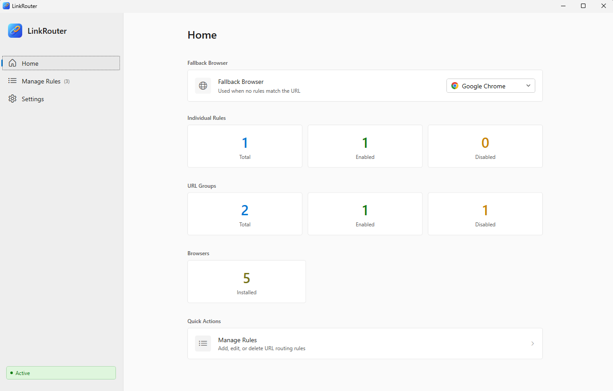

The **Home** tab shows your fallback browser selection, statistics for your rules and groups, and quick actions to manage your configuration.

---

## Features

### URL Rules

Rules tell LinkRouter which browser to use for specific websites. For example:
- `github.com` → Open in Chrome (Work profile)
- `netflix.com` → Open in Firefox (Personal profile)

<br/>

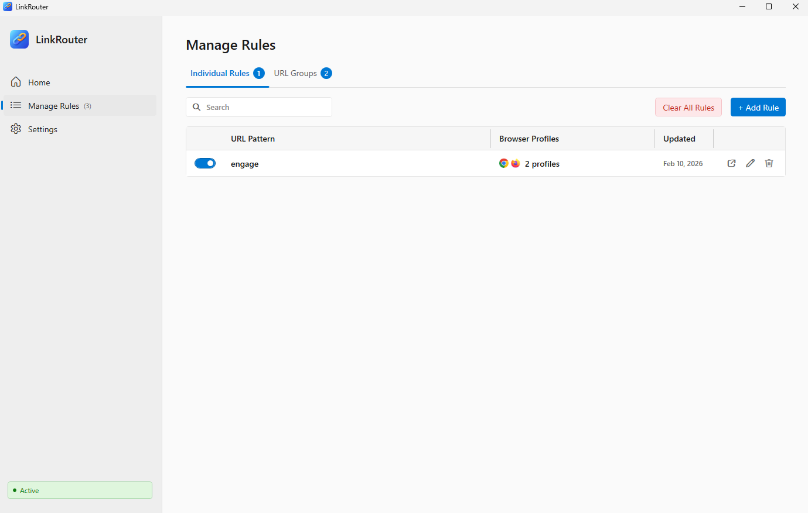

Each rule displays:
- **Toggle switch** — Enable or disable the rule
- **URL pattern** — The domain or keyword to match
- **Browser profiles** — Which browser(s) will open matching URLs
- **Last updated** — When the rule was last modified
- **Actions** — Move, edit, or delete the rule

<br/>

**Creating a Rule:**

1. Click **Manage Rules** in the sidebar
2. Click the **+ Add Rule** button
3. Enter a URL pattern (like `github.com` or `slack`)
4. Select a browser and profile
5. Click **Add**

<br/>

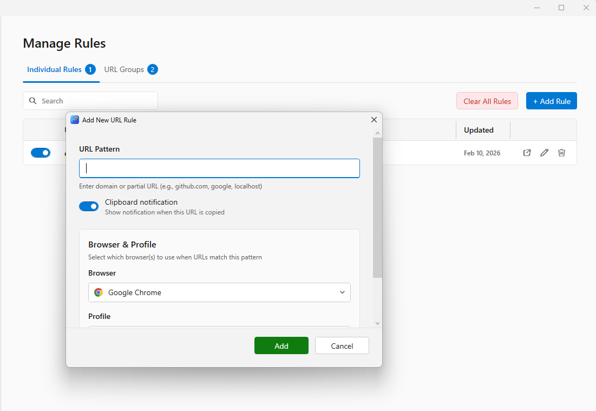

Enter any domain name or keyword. LinkRouter will match it against URLs and open them in your chosen browser.

---

### URL Groups

URL Groups let you manage many related URLs together. Instead of creating 20 separate rules for Microsoft services, create one group with all the URLs.

<br/>

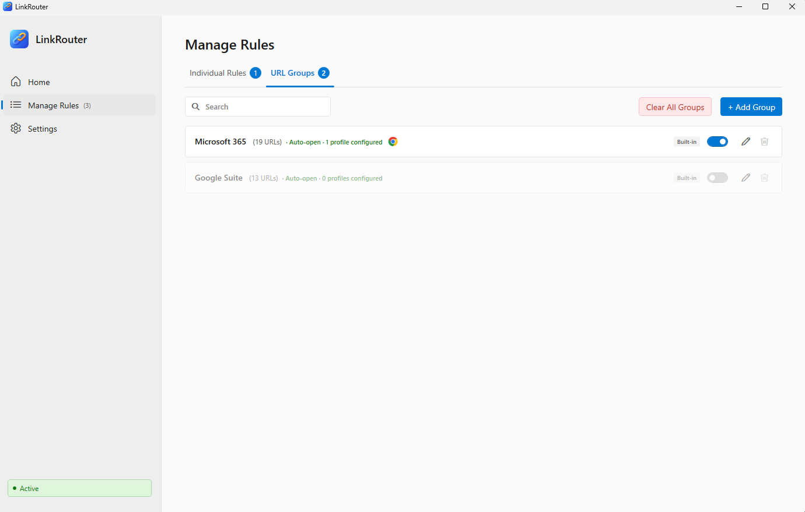

**Built-in Groups (disabled by default):**

| Group | Services Included | URLs |
|-------|-------------------|------|
| **Microsoft 365** | Outlook, Teams, SharePoint, OneDrive, Azure, Office | 19 |
| **Google Suite** | Gmail, Drive, Docs, Sheets, Calendar, Meet, Chat | 13 |

Enable a built-in group, assign a browser, and all those URLs are handled automatically.

<br/>

**Editing a Group:**

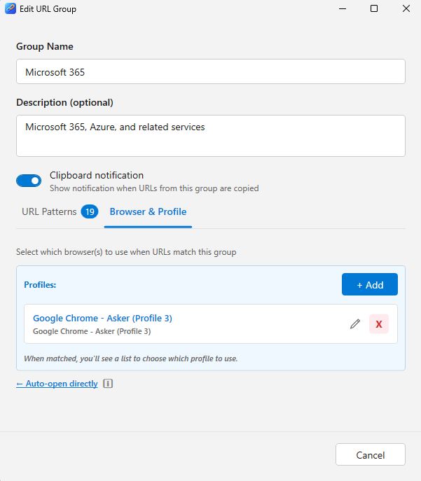

Configure the group name, description, URL patterns, and which browser/profile to use. You can also enable clipboard notifications for the entire group.

<br/>

**Moving Rules to Groups:**

Keep your configuration organized by moving individual rules into groups:

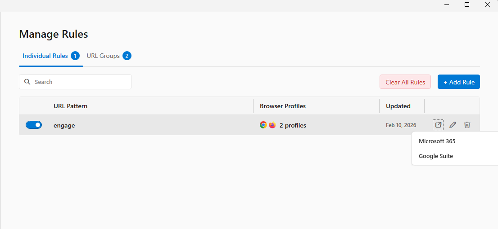

Click the export icon on any rule to move it into Microsoft 365, Google Suite, or your own custom groups.

---

### Multi-Profile Selection

Sometimes you need to choose which browser to use each time. A work URL might need your Work Chrome profile or Personal Firefox depending on the situation.

| Profiles Assigned | Behavior |
|-------------------|----------|
| 1 profile | Opens automatically |
| 2+ profiles | Shows picker to choose |

<br/>

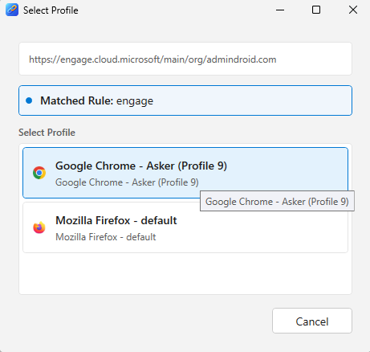

When a URL matches a rule with multiple profiles:
- The URL and matched rule name appear at the top
- Click any profile to open the link
- Click Cancel to close without opening

---

### Smart Notifications

When you click a URL that doesn't match any rule, LinkRouter opens it in your fallback browser and shows a notification.

<br/>

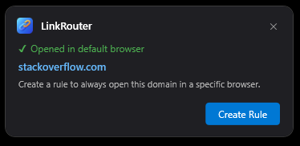

Click **Create Rule** to instantly add a rule for that domain — no need to open settings and configure it manually.

---

### Clipboard Monitoring

When you copy a URL that matches an existing rule, LinkRouter shows you where it will open.

<br/>


The notification shows:
- The domain you copied
- Which rule matched
- Which browser and profile will be used
- Option to open immediately or dismiss

---

### System Tray

LinkRouter runs in your system tray for quick access without opening the full settings window.

<br/>

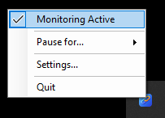

Right-click the tray icon for quick options:
- **Monitoring Active** — Toggle clipboard monitoring
- **Pause for...** — Temporarily disable monitoring
- **Settings** — Open the settings window
- **Quit** — Close LinkRouter

---

## Settings

The Settings page controls how LinkRouter behaves.

<br/>

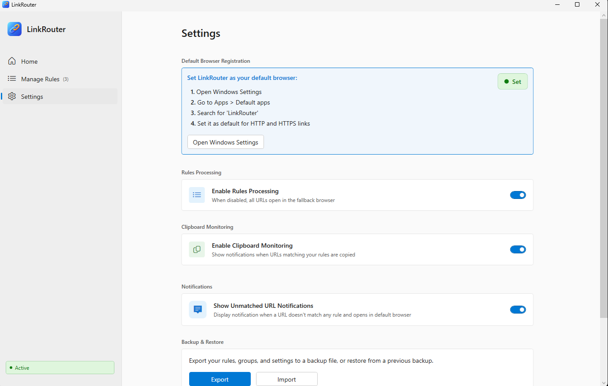

<br/>

### Default Browser Registration

The status indicator at the bottom-left shows your setup status:

| Status | Meaning |
|--------|---------|
| 🟢 **Active** | LinkRouter is your default browser — everything works |
| 🟠 **Not Default** | You need to set LinkRouter as default in Windows |

<br/>

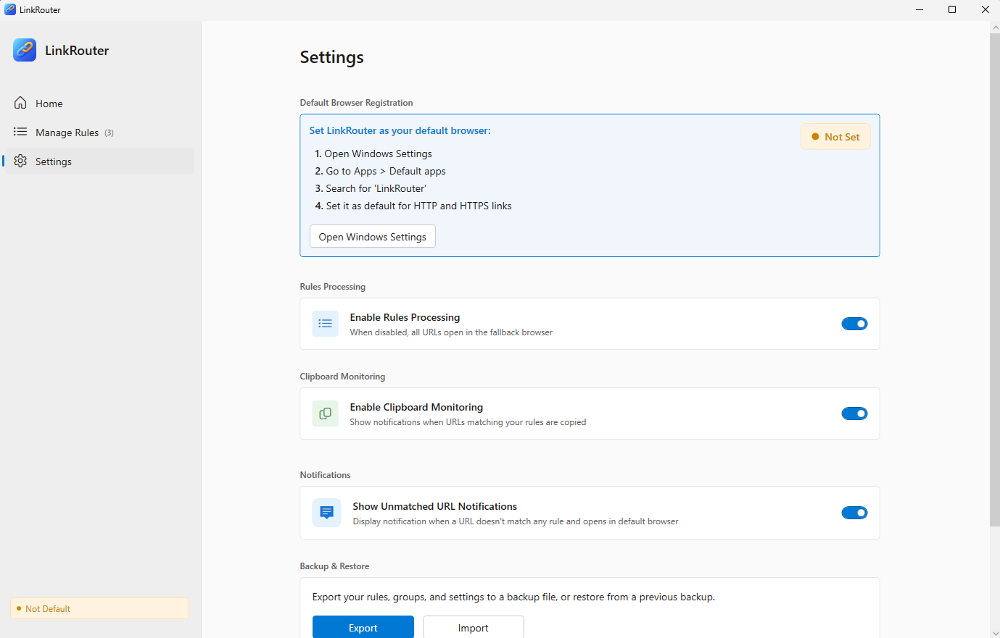

If you see the orange "Not Default" status, click **Open Windows Settings** and set LinkRouter as your default browser.

<br/>

### Available Options

| Setting | Description |
|---------|-------------|
| **Enable Rules Processing** | Master switch — turn OFF to send all URLs to fallback browser |
| **Enable Clipboard Monitoring** | Get notified when you copy a URL that matches a rule |
| **Show Unmatched URL Notifications** | See a notification when opening unknown URLs |

<br/>

### Backup & Restore

Never lose your configuration — export everything to a file.

<br/>

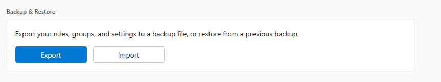

- **Export** — Save all rules, groups, and settings to a JSON file
- **Import** — Restore from a backup (creates a safety backup first)

<br/>

### Data Storage

Your data is saved in `%APPDATA%\LinkRouter\`:

| File | Contents |
|------|----------|
| `settings.json` | Preferences and fallback browser |
| `rules.json` | Individual URL rules |
| `urlgroups.json` | URL groups and patterns |
| `backups/` | Automatic backups |

---

## Installation

### Requirements

- Windows 10 (1607+) or Windows 11
- 64-bit (x64) architecture

### Option 1: Installer (Recommended)

1. Download `LinkRouterSetup-1.0.0.exe` from [Releases](https://github.com/AskerFED/link-router/releases)
2. Run the installer and follow the prompts
3. Application installs to `C:\Program Files\LinkRouter\`

### Option 2: Build from Source

```bash
git clone https://github.com/AskerFED/link-router.git
cd LinkRouter
dotnet publish BrowserSelector.csproj -c Release -r win-x64 --self-contained
```

Output: `bin\Release\net8.0-windows\win-x64\publish\LinkRouter.exe`

### Option 3: Portable

Copy `LinkRouter.exe` anywhere and run it. Data is stored in `%APPDATA%\LinkRouter\`.

---

## How It Works

```
URL clicked (Teams, Outlook, Slack, etc.)
        ↓
LinkRouter intercepts as default browser
        ↓
┌──────────────────────────────────────┐
│  Check URL Groups                    │
│  (Microsoft 365, Google Suite, etc.) │
└──────────────────┬───────────────────┘
                   ↓ No match
┌──────────────────────────────────────┐
│  Check Individual Rules              │
│  (your custom URL rules)             │
└──────────────────┬───────────────────┘
                   ↓ No match
┌──────────────────────────────────────┐
│  Open in Fallback Browser            │
│  (show notification to create rule)  │
└──────────────────────────────────────┘
```

### Pattern Matching

| Pattern | What It Matches |
|---------|-----------------|
| `github.com` | github.com, www.github.com, gist.github.com |
| `docs.google.com` | Only docs.google.com |
| `sharepoint.com` | All SharePoint sites |
| `slack` | Any URL containing "slack" |

Patterns are case-insensitive and match anywhere in the domain.

---

## Command-Line Options

| Argument | Description |
|----------|-------------|
| `<url>` | Process URL through routing rules |
| `--manage` | Open Settings window |
| `--register` | Register as browser and open Settings |
| `--unregister` | Unregister from Windows |
| `--startup` | Silent launch (for Windows startup) |

**Examples:**

```bash
LinkRouter.exe "https://github.com/user/repo"
LinkRouter.exe --manage
LinkRouter.exe --register
```

---

## Troubleshooting

### Check Your Status First

Look at the status indicator in the bottom-left of Settings:
- 🟢 **Active** — Everything is working
- 🟠 **Not Default** — Set LinkRouter as your default browser

### LinkRouter doesn't appear in Default Apps

1. Run `LinkRouter.exe --register` from command line
2. Sign out of Windows and sign back in
3. Try again in Windows Settings

### Clicking links doesn't use my rules

1. Is the status showing "Active" (green)?
2. Is "Enable Rules Processing" turned on?
3. Is the specific rule enabled (blue toggle)?
4. Does your pattern actually match the URL?

### Browser profiles not showing

1. Close the browser completely (check Task Manager)
2. Restart LinkRouter
3. Profiles should now appear

### Pattern not matching

- Patterns are case-insensitive
- Patterns match anywhere in the domain
- No wildcards needed — `sharepoint.com` matches all subdomains

### Logs

Check `%APPDATA%\LinkRouter\` for `log.txt`

---

## Browser Support

| Browser | Profile Detection |
|---------|-------------------|
| Google Chrome | ✓ Full support |
| Microsoft Edge | ✓ Full support |
| Mozilla Firefox | ✓ Full support |
| Brave Browser | ✓ Full support |
| Opera | ✓ Full support |
| Opera GX | ✓ Full support |

Detected profile information includes:
- Profile name
- Account email (if signed in)
- Profile path

---

## Contributing

1. Fork the repository
2. Create a feature branch: `git checkout -b feature/my-feature`
3. Make your changes and test thoroughly
4. Commit: `git commit -m "Add my feature"`
5. Push: `git push origin feature/my-feature`
6. Open a Pull Request

---

## License

MIT License — See [LICENSE](LICENSE) file for details.

---

**LinkRouter** — Smart URL routing for Windows
